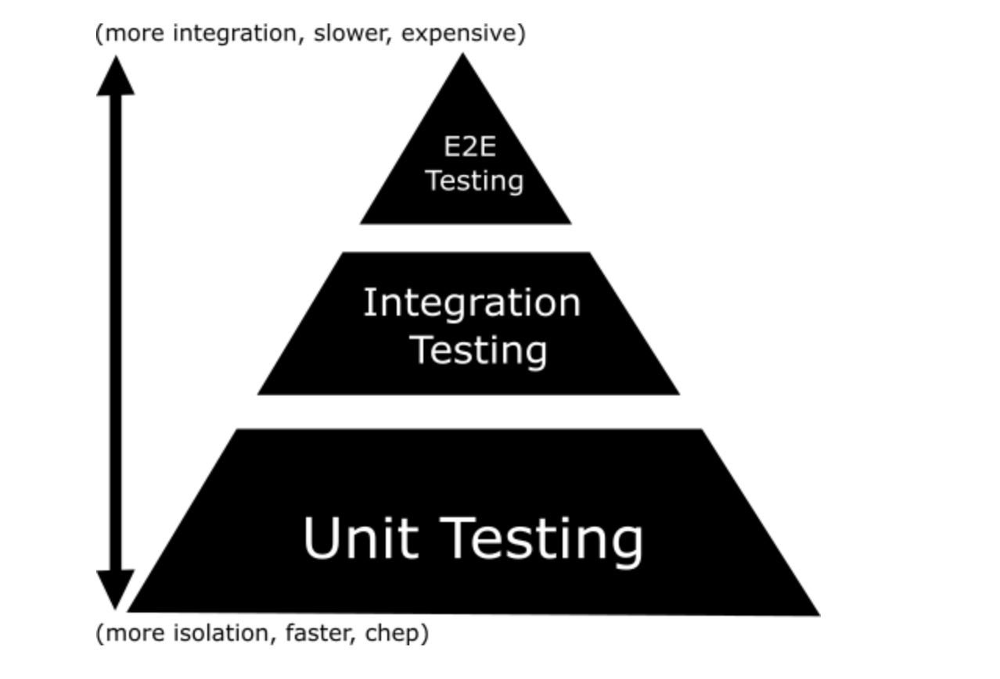

# Testing in Go
Testing is part of the software development process and the purpose is to produce better software, more robust, with fewer bugs, and more stable.
There are different kinds of testing that can be done to improve software quality. 
Starting with ```unit testing```, ```integration testing```, ```end to end testing```.



we can see that unit testing is cheaper and faster to do. That is why we should cover unit test as much as possible to reduce the testing need to be done on integration and end-to-end testing.

## Unit testing
a unit testing is a way of testing unit pecie of code {or say smallest peice of code testing}...

## Steps for Unit testing

make sure you have intialized a repository or file which you want to test use ```go mod init``` command like this ```go mod init github.com/shubhammishra-1```

suppose we want to test a  file named as ```main.go``` so to test this file we must to create a file with its name by ending ```_test.go```

for example:: for ```main.go``` it will be ```main_test.go```


in ```main_test.go``` file testing functions must be start with ```Test```Something()

and each testing must be parametrized with ```t *testing.T``` 

```T is a type passed to Test functions to manage test state and support formatted test logs.```
A test ends when its Test function returns or calls any of the methods FailNow, Fatal, Fatalf, SkipNow, Skip, or Skipf. Those methods, as well as the Parallel method, must be called only from the goroutine running the Test function.
The other reporting methods, such as the variations of Log and Error, may be called simultaneously from multiple goroutines. 

```T for tests, F for fuzzing, B for benchmarking, etc. That reference is in the variable t```


## testing commands

to test all files use this command

``go test -v``

to see covrage of testing

```go test -cover```


# References

```https://www.kelche.co/blog/go/golang-tests/```

```https://medium.com/deliveryherotechhub/how-to-write-unit-test-in-go-1df2b98ad510```

```https://fossa.com/blog/golang-best-practices-testing-go/```

```https://pkg.go.dev/testing```

```https://blogs.halodoc.io/golang-unit-testing/```

```https://blog.jetbrains.com/go/2022/11/22/comprehensive-guide-to-testing-in-go/```